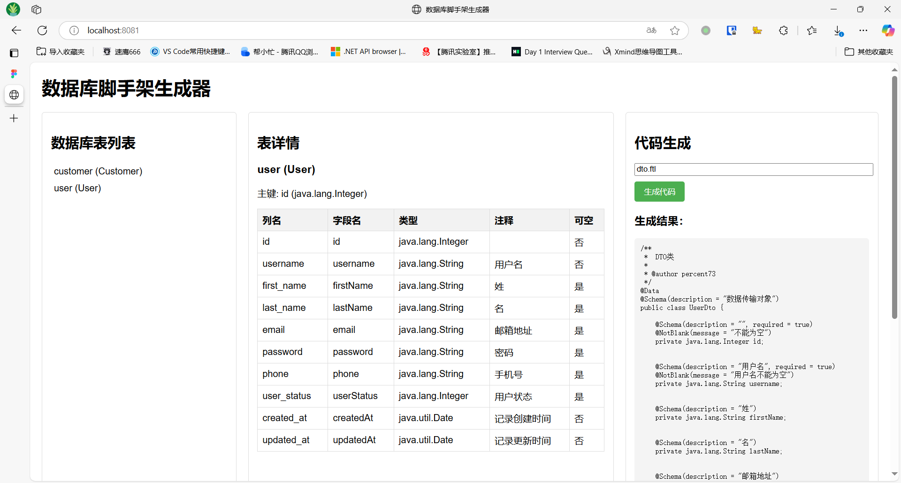

# 开发者文档

## 项目结构

```
deploy/                   # 部署相关目录
├── config/               # 配置文件目录
├── docker/               # Docker相关文件目录
└── sql/                  # SQL脚本目录

module-common/            # 通用模块
└── src/                  # 源代码目录
    ├── main/             # 主代码目录
    │   ├── java/         # Java源代码根目录
    │   │   └── com/basis67/dbkits/common/ # 通用模块包路径
    │   │       ├── dto/  # 数据传输对象（通用数据传输载体）
    │   │       └── model/ # 数据模型层（通用数据模型）
    │   └── resources/    # 资源文件目录
    └── test/             # 测试代码目录
        └── java/         # 测试Java代码目录

module-generator/         # 代码生成模块
└── src/                  # 源代码目录
    └── main/             # 主代码目录
        ├── java/         # Java源代码根目录
        │   └── com/basis67/dbkits/generator/ # 代码生成模块包路径
        │       ├── controllers/ # API控制器层（处理HTTP请求，代码生成相关）
        │       ├── dto/         # 数据传输对象（代码生成数据传输载体）
        │       ├── exception/   # 自定义异常处理（代码生成异常管理）
        │       ├── model/       # 数据模型层（代码生成数据模型）
        │       ├── service/     # 业务逻辑层（代码生成核心服务实现）
        │       └── util/        # 工具类（代码生成相关工具）
        └── resources/    # 资源文件目录
            ├── static/   # 静态资源目录
            ├── templates/ # 模板文件目录（代码生成模板）
            └── application.yml # 代码生成器服务配置文件

project-demo/             # 项目演示模块
└── src/                  # 源代码目录
    ├── main/             # 主代码目录
    │   ├── java/         # Java源代码根目录
    │   │   └── com/basis67/dbkits/ # 项目演示模块包路径
    │   │       ├── controllers/ # API控制器层（处理HTTP请求，项目演示相关）
    │   │       ├── dto/         # 数据传输对象（项目演示数据传输载体）
    │   │       ├── exception/   # 自定义异常处理（项目演示异常管理）
    │   │       ├── mapper/      # MyBatis映射接口（项目演示数据库操作声明）
    │   │       ├── model/       # 数据模型层
    │   │       │   ├── mongo/   # MongoDB文档模型（项目演示NoSQL数据实体）
    │   │       │   └── mysql/   # MySQL实体模型（项目演示关系型数据库实体）
    │   │       ├── repository/  # 数据访问仓库接口（项目演示数据库操作抽象）
    │   │       └── service/     # 业务逻辑层（项目演示核心服务实现）
    │   └── resources/          # 资源文件目录
    │   ├── application.yml     # 主配置文件（项目演示Spring Boot配置）
    │   └── generatorConfig.xml # MyBatis Generator配置文件（数据库CRUD代码生成配置）
    └── test/             # 测试代码目录
        └── java/         # 测试Java代码目录
            └── com/basis67/dbkits/ # 测试类包路径（对应项目演示的单元测试）
                ├── controllers/ # 控制器层单元测试
                └── service/     # 服务层单元测试
```

## 部署工程

详见[dbkits-basis67/deploy at main · basis67/dbkits-basis67](https://github.com/basis67/dbkits-basis67/tree/main/deploy)

## 快速启动

### 克隆仓库

```bash
git clone https://github.com/basis67/dbkits-basis67.git
cd dbkits-basis67
```

### 配置环境

修改 `project-demo/src/main/resources/application.yml`

```yaml
spring:
  datasource:
    url: jdbc:mysql://localhost:3306/dbkits?useSSL=false
    username: root
    password: your_password
  data:
    mongodb:
      uri: mongodb://localhost:27017/dbkits
```

### 启动演示项目

#### 启动服务

``` bash
cd project-demo
mvn spring-boot:run
```

> 需要安装 Java 8 及以上版本。

#### 访问Swagger API文档

启动服务后在本地浏览器打开：[http://localhost:8080/swagger-ui/](http://localhost:8080/swagger-ui/)

#### 生成数据库CRUD代码

``` bash
cd project-demo
mvn mybatis-generator:generate
```

### 使用代码生成器服务

#### 启动服务

``` bash
cd module-generator
mvn spring-boot:run
```

#### 访问代码生成器服务

- 在`Resources`文件夹中新建模板文件（或使用预置的模板文件）
- 启动服务后，在本地浏览器中打开 [http://localhost:8081/](http://localhost:8081/)
- 在`代码生成`位置输入代码生成模板文件的名称，点击生成代码，等待生成结果，复制出结果位置的代码即可。
- 使用示例：
 

## 使用示例

### users

users是一个MySQL数据表。在`project-demo/src/main/java/com/basis67/dbkits/controllers/`位置。

#### 创建记录

request：(发送请求)

``` bash
curl -v -X POST "http://localhost:8080/api/v1/users" \
-H "Content-Type: application/json" \
-d '{"username":"zhangsan","firstName":"Zhang","lastName":"San","email":"zhangsan@example.com"}'
```

response：（响应示例）

```bash
HTTP/1.1 201 Created
```

#### 查询记录

request：(发送请求)

```bash
curl -v -X GET "http://localhost:8080/api/v1/users/1" \
-H "Content-Type: application/json"
```

> 查询`id`为`1`的user。

response:(响应示例)

```json
{
	"username": "zhangsan",
	"firstName": "Zhang",
	"lastName": "San",
	"email": "zhangsan@example.com"
}
```

### logs

logs是一个MongoDB集合。在`project-demo/src/main/java/com/basis67/dbkits/controllers/`位置。

#### 创建文档

request：(发送请求)

```bash
curl -v -X POST "http://localhost:8080/api/v1/logs" \
-H "Content-Type: application/json" \
-d '{"action":"login","userId":"1","details":"user logged in.","timestamp":"2025-03-19T09:55:00Z"}'
```

response：（响应示例）

```bash
HTTP/1.1 201 Created
```

#### 查询文档

request：(发送请求)

```bash
curl "http://localhost:8080/api/v1/logs/action?action=login&start=2025-03-19T08:00:00Z&end=2025-03-19T10:00:00Z"
```

> 查询`2025-03-19T08:00:00Z`到`2025-03-19T10:00:00Z`期间的所有`login`操作日志。

response:(响应示例)

```json
{
  "code": 200,
  "message": "Success",
  "data": [
      {
        "id": "6417b2d1a1b2c3d4e5f6a7b8",
        "action": "login",
        "userId": "1",
        "details": "user logged in.",
        "timestamp": "2025-03-19T09:55:00Z"
      }
  ]
}
```
