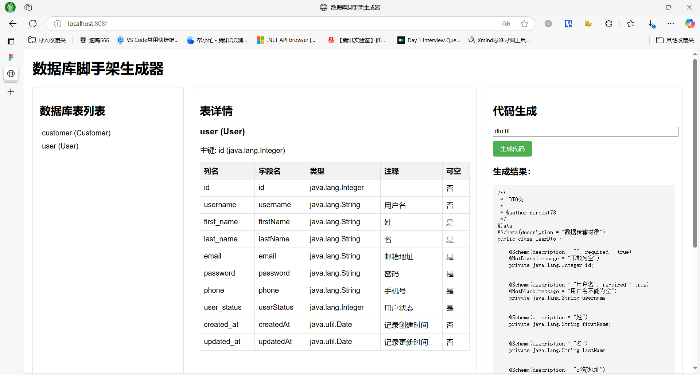

# Basis67 DBKits - 数据库脚手架工程

## 项目简介

Basis67 DBKits 是一个基于Java SpringBoot技术栈的快速开发脚手架，提供：

* 📦 多数据库支持（MySQL + MongoDB）
* 🛠️ 标准化RESTful API开发模板
* 📑 自动生成Swagger API文档
* 🔧 MyBatis持久层集成
* 🚀 快速搭建可伸缩的数据服务层
* 🏭 可定制的代码生成器（基于FreeMarker模板引擎）

## 技术栈

| 类型       | 技术组件                        |
| -------- | --------------------------- |
| 核心框架     | Spring Boot 3.4.3           |
| 持久层      | MyBatis 3.0.4 / Spring Data |
| 关系型数据库   | MySQL 8.0+ / MariaDB 10.0+  |
| NoSQL数据库 | MongoDB 8.0+                |
| API文档    | Swagger UI 3.0              |
| 构建工具     | Maven 3.8+                  |
| 测试框架     | JUnit 5 + Mockito           |
| 模板引擎     | FreeMarker 2.3.34           |

## 项目结构

```text
deploy/                   # 部署相关目录
├── config/               # 配置文件目录
├── docker/               # Docker相关文件目录
└── sql/                  # SQL脚本目录

module-common/            # 通用模块
└── src/                  # 源代码目录
    ├── main/             # 主代码目录
    │   ├── java/         # Java源代码根目录
    │   │   └── com/basis67/dbkits/common/ # 通用模块包路径
    │   │       ├── dto/  # 数据传输对象（通用数据传输载体）
    │   │       └── model/ # 数据模型层（通用数据模型）
    │   └── resources/    # 资源文件目录
    └── test/             # 测试代码目录
        └── java/         # 测试Java代码目录

module-generator/         # 代码生成模块
└── src/                  # 源代码目录
    └── main/             # 主代码目录
        ├── java/         # Java源代码根目录
        │   └── com/basis67/dbkits/generator/ # 代码生成模块包路径
        │       ├── controllers/ # API控制器层（处理HTTP请求，代码生成相关）
        │       ├── dto/         # 数据传输对象（代码生成数据传输载体）
        │       ├── exception/   # 自定义异常处理（代码生成异常管理）
        │       ├── model/       # 数据模型层（代码生成数据模型）
        │       ├── service/     # 业务逻辑层（代码生成核心服务实现）
        │       └── util/        # 工具类（代码生成相关工具）
        └── resources/    # 资源文件目录
            ├── static/   # 静态资源目录
            ├── templates/ # 模板文件目录（代码生成模板）
            └── application.yml # 代码生成器服务配置文件

project-demo/             # 项目演示模块
└── src/                  # 源代码目录
    ├── main/             # 主代码目录
    │   ├── java/         # Java源代码根目录
    │   │   └── com/basis67/dbkits/ # 项目演示模块包路径
    │   │       ├── controllers/ # API控制器层（处理HTTP请求，项目演示相关）
    │   │       ├── dto/         # 数据传输对象（项目演示数据传输载体）
    │   │       ├── exception/   # 自定义异常处理（项目演示异常管理）
    │   │       ├── mapper/      # MyBatis映射接口（项目演示数据库操作声明）
    │   │       ├── model/       # 数据模型层
    │   │       │   ├── mongo/   # MongoDB文档模型（项目演示NoSQL数据实体）
    │   │       │   └── mysql/   # MySQL实体模型（项目演示关系型数据库实体）
    │   │       ├── repository/  # 数据访问仓库接口（项目演示数据库操作抽象）
    │   │       └── service/     # 业务逻辑层（项目演示核心服务实现）
    │   └── resources/          # 资源文件目录
    │   ├── application.yml     # 主配置文件（项目演示Spring Boot配置）
    │   └── generatorConfig.xml # MyBatis Generator配置文件（数据库CRUD代码生成配置）
    └── test/             # 测试代码目录
        └── java/         # 测试Java代码目录
            └── com/basis67/dbkits/ # 测试类包路径（对应项目演示的单元测试）
                ├── controllers/ # 控制器层单元测试
                └── service/     # 服务层单元测试
```

## 快速启动

### 1. 克隆仓库

```shell
git clone https://github.com/basis67/dbkits-basis67.git
cd dbkits-basis67
```

### 2. 配置环境

- 修改 `project-demo/src/main/resources/application.yml` ：

```yaml
spring:
  datasource:
    url: jdbc:mysql://localhost:3306/dbkits?useSSL=false
    username: root
    password: your_password
  data:
    mongodb:
      uri: mongodb://localhost:27017/dbkits
```

### 3. 启动服务（项目演示）

```shell
cd project-demo
mvn spring-boot:run
```

### 4. 访问Swagger API文档

浏览器打开：<http://localhost:8080/swagger-ui/>

### 5. 生成数据库CRUD代码（项目演示）

```shell
cd project-demo
mvn mybatis-generator:generate
```

### 6. 启动“代码生成器”服务

```shell
cd module-generator
mvn spring-boot:run
```

### 7. 访问“代码生成器”服务

浏览器打开：<http://localhost:8081/>



## 使用示例

### 创建MySQL记录

**请求：**

```bash
curl -v -X POST "http://localhost:8080/api/v1/users" \
-H "Content-Type: application/json" \
-d '{"username":"zhangsan","firstName":"Zhang","lastName":"San","email":"zhangsan@example.com"}'
```

**响应：**

```text
HTTP/1.1 201 Created
```

### 查询MongoDB文档

**请求：**

```bash
curl "http://localhost:8080/api/v1/logs/action?action=login&start=2025-03-19T08:00:00Z&end=2025-03-19T10:00:00Z"
```

**响应：**

```json
{
  "code": 200,
  "message": "Success",
  "data": [
      {
        "id": "6417b2d1a1b2c3d4e5f6a7b8",
        "action": "login",
        "userId": "1",
        "details": "user logged in.",
        "timestamp": "2025-03-19T09:55:00Z"
      }
  ]
}

```


## 功能特性

1. **双数据库支持**：
	* MySQL关系型数据存储（使用MyBatis）
	* MongoDB文档存储（使用Spring Data）

2. **标准化API设计**：
	* 统一响应格式（HTTP标准响应码 + code/message/data）
	* 分页查询支持（page/size参数）
	* RESTful风格接口设计

3. **开发效率提升**：
	* Swagger UI实时API文档
	* 通用DTO对象转换
	* 异常统一处理机制

4. **扩展性设计**：
	* 模块化代码结构
	* 仓库模式数据访问层
	* 配置化数据库连接


## 测试覆盖

* 单元测试：JUnit 5 + Mockito
* 集成测试：Testcontainers（可选）
* API测试：Swagger Contract

## 贡献指南

1. Fork仓库并创建新分支

2. 提交代码前运行：

    ```bash
    mvn clean test
    ```

3. 提交PR时请遵循[Conventional Commits规范](https://www.conventionalcommits.org/)
